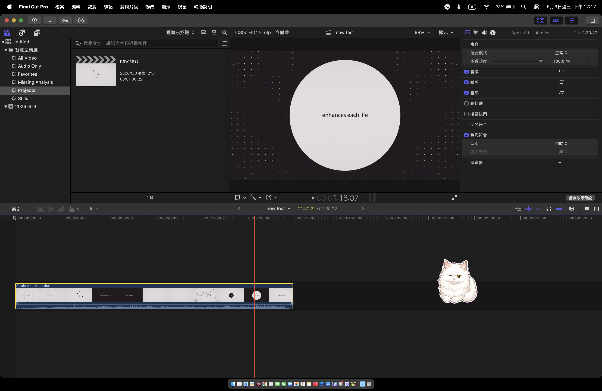

# Final Cut Pro 繁體中文化

這個專案以官方 `zh_CN.lproj` 為來源，產生可放回 Final Cut Pro 的 `zh_TW.lproj`。

本工具不是 Apple 官方產品，不包含 Final Cut Pro 原廠語系檔；所有語系內容皆由使用者本機已安裝的 Final Cut Pro 產生。

## 畫面預覽



## 一般使用者

雙擊：

```text
FinalCut_Pro_TC_OneClick.command
```

工具會自動：

1. 尋找 `/Applications/Final Cut Pro.app`。
2. 從這台 Mac 已安裝的 Final Cut Pro 讀取官方簡中語系。
3. 產生完整巢狀繁體中文語系包。
4. 安裝所有可寫入的 `zh_TW.lproj`。
5. 將既有語系備份到 `~/Movies/FinalCut_Pro_TC_Backups/`。

若 macOS 顯示 `Operation not permitted`，請到「系統設定」->「隱私權與安全性」->「完整磁碟存取權」，將 Terminal 加入並開啟權限。若系統有「App Management / App 管理」，也請允許 Terminal 修改 App。

## 公開分享

這個專案適合分享「一鍵轉換工具」，不要分享已經產生好的 `zh_TW.lproj`。原因是產生後的語系檔會包含 Final Cut Pro 原本的文字內容；公開工具本身比較乾淨，也比較適合不同版本的 Final Cut Pro。

### 如果你只是想安裝繁體中文化

1. 下載 [`FinalCut_Pro_TC_Public.zip`](downloads/FinalCut_Pro_TC_Public.zip)。
2. 解壓縮 zip。
3. 確認 Final Cut Pro 已經完全關閉。
4. 雙擊 `FinalCut_Pro_TC_OneClick.command`。
5. 依照畫面提示輸入 Mac 登入密碼，等待工具完成。
6. 重新打開 Final Cut Pro。

如果 macOS 阻擋執行，請在檔案上按右鍵，選擇「打開」，再按一次「打開」。如果安裝時出現 `Operation not permitted`，請到「系統設定」->「隱私權與安全性」->「完整磁碟存取權」，允許 Terminal 存取。

### 如果你是專案維護者，要產生分享用 zip

雙擊：

```text
Create_Public_Package.command
```

工具會建立：

```text
release/FinalCut_Pro_TC_Public.zip
```

把這個 zip 複製到 `downloads/FinalCut_Pro_TC_Public.zip`，或上傳到 GitHub Releases，讓使用者下載即可。

公開 zip 只會包含：

- `FinalCut_Pro_TC_OneClick.command`
- `Install_FinalCut_Pro_TC.command`
- `Uninstall_FinalCut_Pro_TC.command`
- `scripts/localize_zh_tw.py`
- `scripts/build_app_localizations.py`
- `README.md`

它不會包含 `zh_CN.lproj`、`zh_TW.lproj`、`dist` 或任何已轉換完成的 Apple 語系檔。

## 開發使用方式

```sh
python3 scripts/localize_zh_tw.py
```

若電腦已安裝 OpenCC，腳本會自動使用 OpenCC 的 `s2twp.json` 台灣用語轉換。也可以明確指定：

```sh
python3 scripts/localize_zh_tw.py --opencc /usr/local/bin/opencc --opencc-config s2twp.json
```

若要不用 OpenCC、只用內建轉換表：

```sh
python3 scripts/localize_zh_tw.py --opencc off
```

執行後會產生：

- `zh_TW.lproj`：繁體中文化語系資料夾
- `reports/zh_tw_localization_report.json`：轉換與變數檢查報告

可另外執行英文殘留稽核：

```sh
python3 scripts/audit_localization.py
```

報告會輸出到 `reports/english_residue_report.csv`。

若要修正 Final Cut Pro 內 framework、外掛、效果模板中的英文殘留，建議產生完整巢狀語系包：

```sh
python3 scripts/build_app_localizations.py \
  --app "/Applications/Final Cut Pro.app" \
  --output dist/FinalCut_Pro_TC_FullPayload \
  --opencc auto \
  --opencc-config s2twp.json \
  --clean
```

產生後再雙擊 `Install_FinalCut_Pro_TC.command`，安裝器會自動偵測完整語系包並安裝所有巢狀 `zh_TW.lproj`。

公開到 GitHub 時，請只提交工具與腳本，不要提交本機產生的語系檔。`.gitignore` 已排除 `zh_CN.lproj`、`zh_TW.lproj`、`dist`、`release` 和 `reports`。

## 製作策略

1. 以官方簡中語系為基礎，保留原始 `.strings` / plist 結構。
2. 先套用台灣 Final Cut Pro 與剪輯工作常用術語。
3. 再做簡繁字形轉換。
4. 最後檢查 `%@`、`%d`、`%1$@` 這類程式變數是否完整保留。

## 維護建議

Final Cut Pro 更新後，重新複製新版 `zh_CN.lproj`，再執行同一支腳本即可。若發現術語不夠自然，優先補在 `scripts/localize_zh_tw.py` 的 `PHRASE_REPLACEMENTS`，避免手動改輸出的檔案。

## 安裝測試

最簡單的方式是雙擊：

```text
Install_FinalCut_Pro_TC.command
```

安裝器會：

1. 檢查 `zh_TW.lproj` 是否能正常讀取。
2. 自動尋找 `/Applications/Final Cut Pro.app`。
3. 備份既有的 `zh_TW.lproj` 到 `~/Movies/FinalCut_Pro_TC_Backups/`。
4. 將新的 `zh_TW.lproj` 安裝到 Final Cut Pro。

若要移除中文化，可雙擊：

```text
Uninstall_FinalCut_Pro_TC.command
```

也可以手動將 `zh_TW.lproj` 放入：

```text
Final Cut Pro.app/Contents/Resources/
```

如果系統語言設為繁體中文，Final Cut Pro 會優先嘗試讀取 `zh_TW.lproj`。
